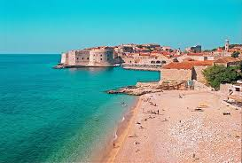
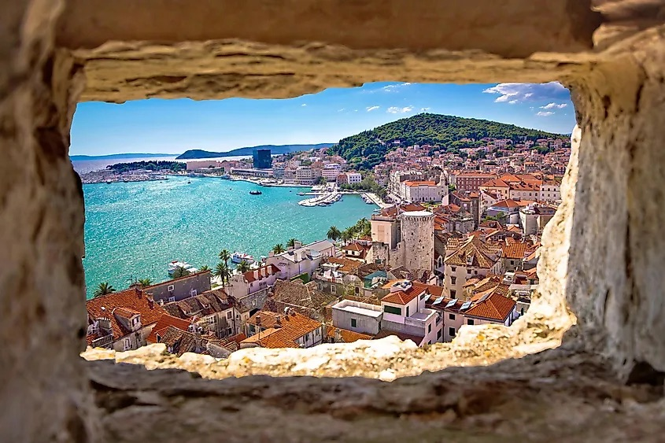
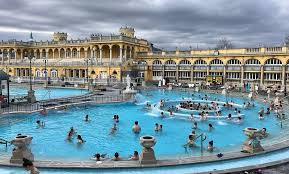
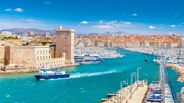
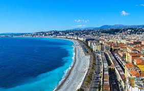
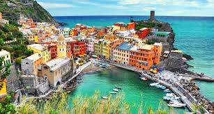
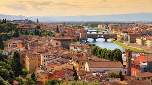
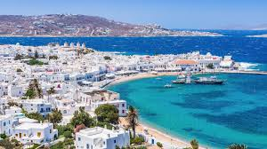

# 🗺️ Europe Trip Itinerary Overview

Each day has its own detail page in the sidebar, but here’s a visual summary of the journey!

---

## 🇭🇷 Dubrovnik  
📅 June 23–24  
🛬 Arrival, beach, explore the old town

---

## 🇭🇷 Split  
📅 June 25–28  
🏛️ Roman ruins, seaside cafes

---

## 🇭🇺 Budapest  
📅 June 29–July 1  
🛁 Thermal baths, nightlife, historic landmarks

---

## 🇫🇷 Marseille  
📅 July 2–3  
⛵ Waterfront, seafood, and port history

---

## 🇫🇷 Nice  
📅 July 4–6  
🌴 Promenade des Anglais, beach time

---

## 🇮🇹 Cinque Terre  
📅 July 7–9  
🌈 Colorful seaside villages

---

## 🇮🇹 Florence or Pisa  
📅 July 10–11  
🎨 Art, cathedrals, Tuscan charm

---

## 🇬🇷 Mykonos (Optional)  
📅 July 12–16  
🏖️ Beaches, white-walled villages, and windmills

